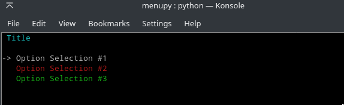

.. menupy documentation master file, created by
   sphinx-quickstart on Thu May  2 21:04:51 2019.
   You can adapt this file completely to your liking, but it should at least
   contain the root `toctree` directive.

menupy Documentation
====================

.. image:: https://img.shields.io/pypi/v/menupy.svg
    :target: https://pypi.org/project/menupy

.. image:: https://img.shields.io/pypi/pyversions/menupy.svg
    :target: https://pypi.org/project/menupy

.. image:: https://img.shields.io/pypi/l/menupy.svg
    :target: https://github.com/luxunator/menupy/blob/master/LICENSE

Interactive Python Menu

**About menupy**

CLI Menu creation with easy, fast, flexible usage for the programmer, and a clean layout for their users.

Installation
++++++++++++

::

    pip install menupy

.. toctree::
   :maxdepth: 2
   :caption: Table of Contents:

   modules

Examples:
^^^^^^^^^
**Option Menu**

::

    import menupy

    NewMenu = menupy.OptionMenu("Title", title_color="cyan")
    NewMenu.add_option("Option Selection #1")
    NewMenu.add_option("Option Selection #2", color="red")
    NewMenu.add_option("Option Selection #3", color="green")
    result = NewMenu.run()

**Input Menu**

::

    import menupy

    NewMenu = menupy.InputMenu("Title", title_color="cyan")
    NewMenu.add_input("Input #1")
    NewMenu.add_input("Input #2", color="magenta")
    NewMenu.add_input("Input #3", color="yellow", input_text="default", input_color="blue")
    result = NewMenu.run()

Indices and tables
==================

* :ref:`genindex`
* :ref:`modindex`
* :ref:`search`
